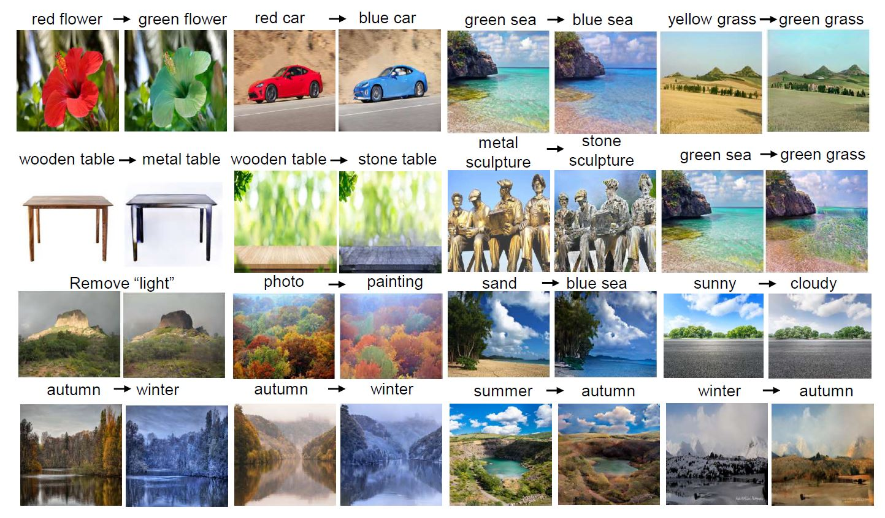

# Open-Edit: Open-Domain Image Manipulation with Open-Vocabulary Instructions

[Xihui Liu](https://xh-liu.github.io), [Zhe Lin](https://sites.google.com/site/zhelin625/), [Jianming Zhang](http://cs-people.bu.edu/jmzhang/), [Handong Zhao](https://hdzhao.github.io/), [Quan Tran](https://research.adobe.com/person/quan-hung-tran/), [Xiaogang Wang](https://www.ee.cuhk.edu.hk/~xgwang/), and [Hongsheng Li](https://www.ee.cuhk.edu.hk/~hsli/).<br>
Published in ECCV 2020.

### [Paper](https://arxiv.org/pdf/2008.01576.pdf) | [1-minute video](https://youtu.be/8E3bwvjCHYE) | [Slides](https://drive.google.com/file/d/1m3JKSUotm6sRImak_qjwBMtMtd037XeK/view?usp=sharing)



### Installation

Clone this repo.
```bash
git clone https://github.com/xh-liu/Open-Edit
cd Open-Edit
```

Install [PyTorch 1.1+](https://pytorch.org/get-started/locally/) and other requirements.
```bash

pip install -r requirements.txt
```

### Download pretrained models

Download pretrained models from [Google Drive](https://drive.google.com/drive/folders/1iG_II7_PytTY6NdzyZ5WDkzPTXcB2NcE?usp=sharing)

### Data preparation

We use [Conceptual Captions dataset](https://ai.google.com/research/ConceptualCaptions/download) for training. Download the dataset and put it under the dataset folder. You can also use other datasets

### Training

The visual-semantic embedding model is trained with [VSE++](https://github.com/fartashf/vsepp).

The image decoder is trained with:

```bash
bash train.sh
```

## Testing

You can specify the image path and text instructions in test.sh.

```bash
bash test.sh
```

### Citation
If you use this code for your research, please cite our papers.
```
@inproceedings{liu2020open,
  title={Open-Edit: Open-Domain Image Manipulation with Open-Vocabulary Instructions},
  author={Liu, Xihui and Lin, Zhe and Zhang, Jianming and Zhao, Handong and Tran, Quan and Wang, Xiaogang and Li, Hongsheng},
  booktitle={European Conference on Computer Vision},
  year={2020}
}
```
